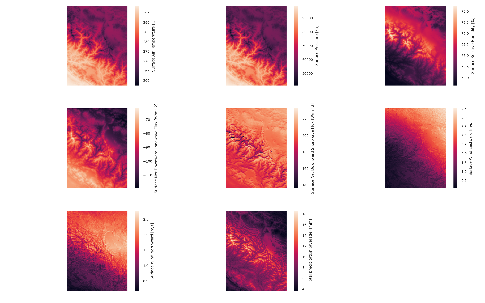
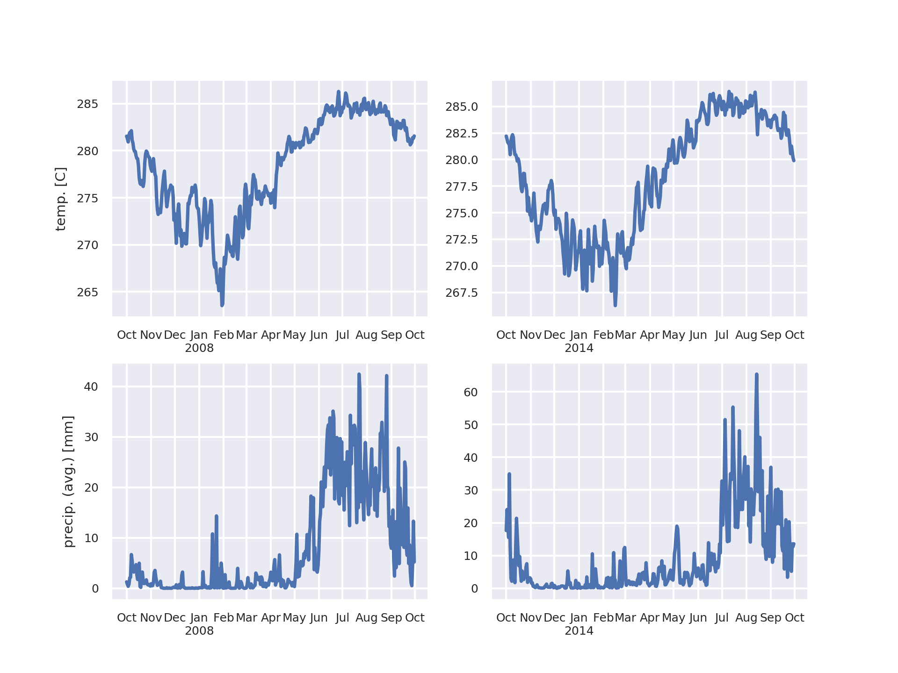

# George Mason University Down Scale (GMUDS)
Python library to subset GMUDS dataset for HiMAT.


# Data Format
Description - The current George Mason University Down Scale (GMUDS) product on the NCCS ADAPT server 
 at the NASA Goddard Space Flight Center is spatially subset and temporally concatenated to create 
 daily collections of hourly surface state variables (**Table 1**). File naming, current variables and 
 descriptions of variable coordinates are described in the following.

## File Naming

himat_gmuds_trishuli_dly_YYYYMMDD.nc4  
 * YYYY - 4 digit year
 * MM - 2 digit month of year
 * DD - 2 digit day of month  

*Example*: File, himat_gmuds_trishuli_dly_20071009.nc4, contains mean hourly surface state variables and 
hourly precipitation rate for October 4th, 2009.
  
## Current Data Variables in Daily Summary

**Table 1**

|   | name | units | variable | description |
|---| ---  | ---   | ---      | ---         |
|1  | Surface Air Temperature   | [K]  | Tad | Average surface air temperature  |
|2. | Surface Pressure          | [Pa] | Pad | Average surface pressure |
|3. | Surface Relative Humidity | [%]  | RHd | Average surface relative humidity |
|4. | Surface Net Downward Longwave Flux  | [W/m^2] | Ld | Average surface net downward longwave flux |
|5. | Surface Net Downward Shortwave Flux | [W/m^2] | Sd | Average surface net downward shortwave flux |
|6. | Surface Wind Eastward     | [m/s] | U | Average surface eastward wind  |
|7. | Surface Wind Northward    | [m/s] | V | Average surface northward wind |
|7. | Total precipitation    | [kg/m^2s] or [mm/s] | PRECTOT | sum of total hourly precipitation estimates. Multiply by 3600 [sec] to get total mm per day|

## Current Data Coordinates  

| -- | name | units | variable | description |
| --- | ---- | ----- | -------- | ----------- |
|1.  | Easting | [m]    | easting | meters east of grid origin |
|2.  | Norting | [m]    | northing | meters north of grid origin |
|3.  | Time    | [hour] | time | hour of day |

## Figures


**Figure 1.** Variable averages of all daily measurements in wy2008 and wy2014.


**Figure 2.** Times-series of average daily measurements in wy2008 and wy2014.


## Latitude Longitude Grid
Latitude and longitude coordinates, in decimal degrees, for each grid-cell center are contained in 
**latlon_trishuli_gmu_ds.nc4**.

## Grid Definition

The downscaled MERRA data is gridded at a 1 km posting over a Lambert conformal conic projection. 
The definition of grid is found below. The grid has 221 rows and 168 columns, the upper left coordinate
is -2004000 meters north, 3877000 meters east of the projection origin,  0N latitude 105E longtitude.


The boundaries of the grid in meters:  
```
(    East,     West,   North,   South)  
(-2004000, -1836000, 3877000, 3656000) # llc - meters  
```
The projection definition in the PROJ4 format:
```
'+proj=lcc +lat_1=30 +lat_2=62 +lat_0=0 +lon_0=105 +x_0=0 +y_0=0 +ellps=WGS84 +datum=WGS84 +units=m +no_defs'
```

```python
crs = '+proj=lcc +lat_1=30 +lat_2=62 +lat_0=0 +lon_0=105 +x_0=0 +y_0=0 +ellps=WGS84 +datum=WGS84 +units=m +no_defs'
grid_size =  (221, 168) # row, col
## TO GRID EDGES
geotransform =  (-2004000, 1000, 0, 3877000, 0, -1000)  # GDAL
```


In the WKT format:
```angular2html
PROJCS["unnamed",
    GEOGCS["WGS 84",
        DATUM["WGS_1984",
            SPHEROID["WGS 84",6378137,298.257223563,
                AUTHORITY["EPSG","7030"]],
            AUTHORITY["EPSG","6326"]],
        PRIMEM["Greenwich",0,
            AUTHORITY["EPSG","8901"]],
        UNIT["degree",0.0174532925199433,
            AUTHORITY["EPSG","9122"]],
        AUTHORITY["EPSG","4326"]],
    PROJECTION["Lambert_Conformal_Conic_2SP"],
    PARAMETER["standard_parallel_1",30],
    PARAMETER["standard_parallel_2",62],
    PARAMETER["latitude_of_origin",0],
    PARAMETER["central_meridian",105],
    PARAMETER["false_easting",0],
    PARAMETER["false_northing",0],
    UNIT["Meter",1]]


```

For reference, the original, larger, grid is defined by:

```python
crs = '+proj=lcc +lat_1=30 +lat_2=62 +lat_0=0 +lon_0=105 +x_0=0 +y_0=0 +ellps=WGS84 +datum=WGS84 +units=m +no_defs'
grid_size =  (3000, 2000) # row, col
geotransform =  (-3000000, 1000, 0, 5000000, 0, -1000)  # GDAL
```


## Python

### Requires
xarray


### Usage

NetCDF files are generated to be compatible with the [xarray](http://xarray.pydata.org/en/stable/) python package.
 
 ```python
import xarray as xr

# open as xarray
ds_file = 'himat_gmuds_trishuli_daily_20080522.nc4'
ds = xr.open_dataset(ds_file)
print(ds)
```

```text
Dimensions:   (x: 168, y: 221)
Coordinates:
    easting   (x) float64 ...
    northing  (y) float64 ...
Dimensions without coordinates: x, y
Data variables:
    Tad       (y, x) float64 ...
    Pad       (y, x) float64 ...
    RHd       (y, x) float64 ...
    Ld        (y, x) float64 ...
    Sd        (y, x) float64 ...
    U         (y, x) float64 ...
    V         (y, x) float64 ...
    PRECTOT   (y, x) float64 ...
    """
```

### Regridding

Requires, scipy
```python
from scipy.interpolate import griddata
import numpy as np

ds_file_latlon = 'latlon_trishuli_gmu_ds.nc4'
ds_latlon = xr.open_dataset(ds_file_latlon)

# get values from nc4 file
lons = ds_latlon.longitude
lats = ds_latlon.latitude

ll_coords = (lons.values.ravel(), lats.values.ravel())
avg_temp = ds['Tad']
ll_vals = avg_temp.values.ravel()

# set regular lat/lon grid
lon_min = 84.9
lon_max = 85.8

lat_min = 27.7
lat_max = 29.1

deg_step = .01

lon_vec = np.arange(lon_min, lon_max, deg_step)
lat_vec = np.arange(lat_min, lat_max, deg_step)

# make new grid centers
lon_arr, lat_arr = np.meshgrid(lon_vec, lat_vec)
new_avg_temp = griddata(ll_coords, ll_vals, (lon_arr, lat_arr), method='nearest')

```

# Notes
## From Email Chain 9/25/16 - Based on Vinod's Input

### Primary Dynamic
* Precipitation <  
* Air Temperature 1   
* Wind Speed 6+7  
* Relative humidity 3   
* Incoming SWR 5 
* Incoming LWR 4   
* Pressure 2

### Secondary Dynamic
* Albedo, Glacier Type etc.  

### Static
* Elevation   
* Leaf Area Index  
* Vegetation Cover  
* Vegetation Height  
* Canopy Cover Fraction
* Soil Bulk Density  

### For Model Validation
* SWE/SWE Change  
* Snow/Glacier Thickness Change  
* Snow/Glacier Temperature  
* Snow/Glacier Melt  
* Evaporation/Sublimation Measurements


## From Rijan - MPDDM Version 2-Rijan.ppx, Slide 1

### Dynamic

* Temperature
* Precipitation
* Lapse Rate
* Precipitation Gradient
* Critical Temperature
* Degree Day Factor

### Static

* Elevation   
* Landuse Class
* Clean Glacier
* Debris
* In situ measurement of flow

# Matching GMUDS Data Available

| --- | name | units |  collection  | shrtname | folder | variable |
| --- | ---- | ----- |  ----------  | -------- | ------ | -------- | 
|1.  | Surface Air Temperature | [K]  |  M2T1NXFLX  |  TLML   |Ambient| Tad | 
|2.  | Surface Pressure |[Pa] | M2T1NXSLV |PS|  Ambient| Pad |
|3.  | Surface Relative Humidity |[%]| M2T1NXFLX | QLML  |Ambient| RHd | 
|4.  | Surface Net Downward Longwave Flux |[W/m^2] | M2T1NXINT | LWGNET | Ambient | Ld |
|5.  | Surface Net Downward Shortwave Flux |[W/m^2] | M2T1NXINT | SWNETSRF|SW| Sd |
|6.  | Surface Wind Eastward |[m/s] | M2T1NXFLX | ULML |UVWind| U |
|7.  | Surface Wind Northward |[m/s] | M2T1NXFLX | VLML  |UVWind| V |
|8.  | Convective Rainfall |[kg/m^2s] | M2T1NXINT | PRECCU  |N/A|
|9.  | Large Scale Rainfall |[kg/m^2s] | M2T1NXINT | PRECLS  |N/A|
|10. | Snowfall |[kg/m^2s] | M2T1NXINT | PRECSN  |N/A|
|11. | Total Precipitation |[kg/m^2s] | M2T1NXINT | PRECTOT  |N/A|
|12. | Total Precipitation - Bias Corrected|[kg/m^2s] | M2T1NXINT | PRECTOTCORR  |N/A|


